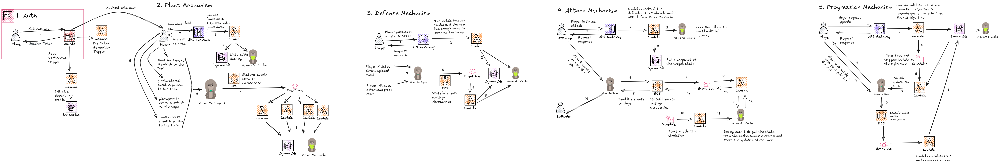

# Clash of Farms 🌾⚔️

**Clash of Farms** is a web-based multiplayer strategy game that blends gardening with real-time battles. Built during the [Spring Hackathon](https://serverlessguru.com) by Serverless Guru, this project showcases a fully **serverless** and **event-driven** architecture using AWS and Momento.

---

## 🚀 Tech Stack

- **Frontend:** Next.js + Phaser 3
- **Auth:** AWS Cognito (with custom Lambda triggers)
- **Backend:** AWS Lambda + API Gateway
- **Database:** DynamoDB (Single Table Design)
- **Real-Time Events & Caching:** Momento Cache + Momento Topics
- **Orchestration:** EventBridge + Flask (Topics bridge)

---

## 🧩 Architecture Highlights

- **Authentication Flow:** Cognito with post-confirmation and pre-token generation Lambda triggers.
- **State Management:** Read-aside and write-aside caching with Momento for low-latency player data.
- **In-Game Shop:** Buy plants, attack units, and defense items through API calls and real-time updates.
- **Real-Time Gameplay:** Item placement and updates published from the browser to Momento Topics.
- **Event Handling:** Events routed through a Flask app → EventBridge → Lambda → DynamoDB + Cache updates.

---

## 🧠 Key Features

- 🌽 Plant crops, 💰 earn gold, 🛡️ deploy defenses, and ⚔️ raid other players.
- ⚡ Real-time state sync with ultra-low latency using Momento.
- 🧵 Event-driven coordination across client and backend using publish/subscribe.
- 🔐 Secure publishing to Topics using a Token Vending Machine Lambda.
- 🌍 Fully serverless stack: auto-scaling, cost-effective, and highly modular.

---

## 🧪 Challenges & Lessons Learned

- Orchestrating real-time event flows between the frontend and backend.
- Managing Phaser 3 inside a React-based frontend.
- Designing idempotent Lambdas for reliable, replay-safe operations.
- Debugging async flows with structured logs and trace IDs.
- Implementing secure client-side publish with short-lived Momento tokens.

---

## 📅 What's Next?

- 🎮 Real-time multiplayer raids between players
- 🏆 Leaderboards with seasonal resets
- ⏲️ Offline farm production via scheduled events

---

> Built with 💚 for Spring, farming, and serverless game dev.
